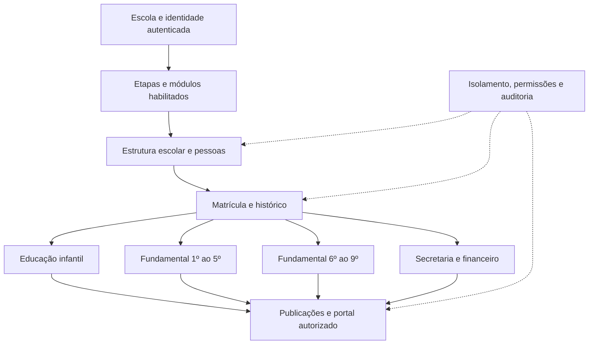

# Arquitetura do sistema escolar — versão 1

Data: 2026-09-29. Documento consolidado de arquitetura e escopo.
O escopo de atendimento foi definido pelo responsável pelo projeto na conversa:
educação infantil, desde o berçário, até o 9º ano do ensino fundamental.
O fechamento deste documento não declara módulos implementados ou produção pronta.

## 1. Visão do produto

Um sistema compartilhado por várias escolas, com dados isolados, que permita
a cada escola executar suas rotinas conforme as etapas que oferece.
Uma mesma escola pode atender educação infantil, anos iniciais, anos finais
ou qualquer combinação dessas etapas.

Atender uma etapa significa concluir seus fluxos essenciais de ponta a ponta,
com persistência, autorização, histórico e testes. Disponibilizar menus ou
cadastros isolados não caracteriza atendimento funcional.

Ensino médio, superior, cursos livres e idiomas como modalidades independentes
ficam fora desta versão. Isso não exclui componentes curriculares de idiomas
no ensino fundamental.

## 2. Decisões fechadas e limites

| Tema | Definição |
| --- | --- |
| Abrangência | Educação infantil e ensino fundamental do 1º ao 9º ano. |
| Organização | Base comum, módulos por escola e processos pedagógicos por etapa. |
| Escola com várias etapas | Usa o mesmo ambiente escolar, com configurações por etapa e período. |
| Isolamento | Escola é a fronteira de dados; habilitar módulos não compartilha dados entre escolas. |
| Identidade | Preservar os ADRs existentes; conta continua vinculada a uma escola. |
| Implementação | Evoluir React, Express e PostgreSQL como monólito modular. |
| Histórico | Aluno, matrícula e renovação são conceitos distintos; mudanças não apagam a trajetória. |
| Entrega | Implementar e comprovar fluxos por etapa, em incrementos verificáveis. |

Não serão criados código, tabelas ou instalações diferentes para cada escola.
Configurações representarão variações suportadas; uma nova regra não prevista
precisa de especificação, sem scripts arbitrários cadastrados pela escola.

## 3. Camadas de configuração

1. **Escola:** dados institucionais e etapas oferecidas.
2. **Módulos:** funcionalidades habilitadas e suas dependências.
3. **Etapa e período letivo:** organização pedagógica, calendário e regras versionadas.
4. **Usuário e vínculo:** operações e registros que a pessoa pode acessar.

Uma ação só é permitida quando escola e identidade estão válidas, o módulo
está habilitado, o usuário possui permissão e o registro pertence ao seu escopo.
Todas essas condições são verificadas no backend; esconder um menu não autoriza
nem bloqueia uma API por si só.

Configuração não muda retroativamente registros encerrados. Alterações precisam
de vigência, versão, autor e auditoria. Desabilitar um módulo não apaga seu
histórico; a política de consulta/exportação de dados antigos deve ser definida
antes da implementação da desabilitação.

## 4. Mapa dos módulos

O catálogo abaixo descreve a arquitetura alvo, não o estado de implementação.

| Módulo | Responsabilidade e dados sob seu controle | Dependências |
| --- | --- | --- |
| Administração e acesso | Escola, etapas oferecidas, módulos habilitados, usuários e permissões | Fundação existente |
| Estrutura escolar | Períodos, calendário, grupos/séries, turnos, turmas e oferta curricular | Administração |
| Pessoas e vínculos | Alunos, responsáveis, profissionais e vínculos autorizados | Administração |
| Matrículas | Ingresso, vínculo no período, alocação, movimentação e renovação | Estrutura + pessoas |
| Secretaria e documentos | Pendências, conferência, emissão e versões de documentos escolares | Pessoas + matrículas; pedagógico quando necessário |
| Pedagógico | Planejamento, frequência, acompanhamento, avaliações e fechamento por etapa | Estrutura + pessoas + matrículas |
| Financeiro | Contratos financeiros, cobranças, descontos, recebimentos e conciliação | Pessoas + matrículas |
| Comunicação e portal | Publicação de informações autorizadas, comunicados e solicitações das famílias | Pessoas + acesso; módulos de origem dos dados |
| Relatórios | Consultas e indicadores com filtros, origem e autorização | Módulos que fornecem os dados |
| Auditoria | Registro de operações, alterações e atores | Transversal, obrigatório para escritas |

Cada módulo é responsável por suas regras e escritas. Relatórios e portal não
mantêm uma segunda versão de matrícula, nota ou cobrança. Operações entre módulos
usam serviços internos com limites explícitos e a mesma transação quando precisam
ser atômicas. Não introduzir microserviços, filas ou provedores sem necessidade demonstrada.

Dependências obrigatórias não podem ser desligadas enquanto um módulo dependente
estiver habilitado. O responsável por habilitar módulos e seus critérios comerciais
ainda será definido; `platform_admin` não ganha bypass global nesta arquitetura.

## 5. Funcionamento por etapa

| Etapa | Organização a suportar | Fluxo pedagógico essencial | Evidência funcional esperada |
| --- | --- | --- | --- |
| Educação infantil | Grupos, faixas etárias configuradas, turnos e profissionais vinculados | Registrar presença, rotina e observações; consolidar acompanhamento do desenvolvimento; publicar informações autorizadas | Registro de uma criança persiste, aparece somente aos profissionais/familiares autorizados e mantém histórico de correções |
| Fundamental: 1º ao 5º | Séries, turmas, componentes e atribuições docentes | Planejar, registrar frequência e avaliações no modelo configurado, revisar e publicar resultados | Fechamento de período reproduz os registros e a regra vigente; família consulta somente seu aluno |
| Fundamental: 6º ao 9º | Séries, turmas, componentes, atribuições docentes e horários | Registrar aulas, frequência e avaliações por componente; consolidar resultados | Professor opera somente atribuições autorizadas; resultados consolidados preservam fonte e versão das regras |

Não presumir que anos iniciais tenham apenas um professor nem que toda escola
use notas numéricas, bimestres ou o mesmo critério de aprovação. Educação infantil
não será modelada obrigatoriamente como boletim de notas. Idade, corte de ingresso,
retenção, promoção, documentos oficiais e exigências locais não são determinados
por este documento: precisam de especificação e verificação aplicável antes de uso.

## 6. Modelo conceitual comum e especializações

O [modelo mínimo escolar](modelo-minimo-escolar.md) detalha a base inicial.
Ele passa a ser um documento subordinado a este escopo consolidado.

- **Escola → etapas oferecidas → configuração por período.**
- **Período → oferta de grupos/séries, turnos e turmas.**
- **Aluno ↔ responsáveis:** vínculos explícitos, com atribuições e vigência.
- **Aluno → matrículas → alocações em turma:** histórico preservado.
- **Profissional → atribuições:** turma, componente quando aplicável e vigência.
- **Pedagógico:** registros de rotina/desenvolvimento ou atividades/avaliações,
  conforme a etapa, sem concentrar todo o domínio em JSON genérico.
- **Financeiro:** obrigação e recebimento separados; responsável financeiro
  não ganha automaticamente acesso pedagógico.
- **Documento/publicação:** conteúdo versionado, autor, destinatários e estado.

Na educação infantil, a organização poderá usar grupo em vez de série. O campo
proposto `grade_level_id` no documento inicial ainda não é contrato de banco:
deve ser ajustado ao conceito de grupo/série antes da migration. Turmas com
mais de um grupo/série permanecem pendentes de definição.

Novas entidades precisam de `school_id`; referências internas usam chaves
compostas que impeçam vínculos entre escolas. Compatibilidade de período,
etapa, turma e matrícula exige validação adicional, além das FKs por escola.

## 7. Fluxos completos de referência

1. **Preparar escola:** definir etapas, habilitar dependências, cadastrar período,
   estrutura e profissionais; validar configurações antes de abrir operações.
2. **Matricular:** cadastrar ou localizar aluno, conferir vínculos, registrar
   matrícula e alocação conforme requisitos; concluir com auditoria atômica.
3. **Operar etapa:** profissional autorizado registra atividades pertinentes;
   secretaria/coordenação revisa e publica conforme permissões definidas.
4. **Atender família:** responsável autenticado consulta apenas os dados e alunos
   autorizados; solicitações geram acompanhamento e não alteram resultados diretamente.
5. **Operar financeiro:** gerar obrigação conforme contrato, registrar recebimento
   e conciliar; repetição de requisição não duplica cobrança ou baixa.
6. **Encerrar e renovar:** consolidar o período pelas regras vigentes, preservar
   histórico e abrir solicitação para o próximo período. Renovação não implica
   promoção automática nem matrícula confirmada sem os requisitos definidos.

## 8. Arquitetura técnica e controles

Frontend React → API Express → serviços dos módulos → PostgreSQL.
Controllers validam entrada e encaminham operações; serviços executam regras;
acesso a dados usa a conexão transacional do TenantContext. Nenhum módulo HTTP
importa conexão administrativa.

Preservar [ADR-001](../decisoes/ADR-001-isolamento-multi-escola.md),
[ADR-002](../decisoes/ADR-002-restricao-alfa-auth.md) e
[TenantContext](tenant-context.md). Migrations existentes não serão reescritas.
RLS ENABLE/FORCE, grants mínimos, autenticação restrita e validação de identidade
continuam sendo requisitos. Novas tabelas entram nas verificações de startup e testes.

Autorização combina perfil, atribuição e vínculo com o registro. Professor não
recebe acesso a todos os alunos apenas por pertencer à escola; família não
acessa outra família da mesma escola. Novas permissões serão negadas por padrão.

Escritas de negócio e auditoria são atômicas. Mudanças de estado têm transições
explícitas. Operações sujeitas a repetição usam idempotência; disputa por vagas
e alterações concorrentes têm proteção transacional. Valores monetários usam
representação decimal exata; regras de cálculo e arredondamento serão especificadas.

Antes de exposição pública: controle de tentativas de login, política de sessão,
transporte protegido, gestão separada de segredos, logs sem dados sensíveis,
monitoramento e restauração de backup comprovada. Uploads e integrações dependem
de desenho específico de armazenamento, autorização, falhas e retenção.
Este documento não certifica conformidade legal nem define prazos legais de retenção.

## 9. Sequência de implementação

| Entrega | Resultado necessário para avançar |
| --- | --- |
| 0 — Fundação existente | Revalidar os controles na mudança; relatórios antigos não substituem execução atual |
| 1 — Configuração e estrutura | Escola com uma ou várias etapas, módulos/dependências, período, grupos/séries, turnos e turmas persistidos e isolados |
| 2 — Pessoas e matrículas | Cadastro, vínculos, ingresso e movimentação com integridade e auditoria |
| 3 — Pedagógico por etapa | Provar separadamente um fluxo de infantil, um de anos iniciais e um de anos finais |
| 4 — Secretaria, financeiro e portal | Provar os fluxos integrados do catálogo; habilitar cada módulo somente após seus critérios de aceite |
| 5 — Encerramento e renovação | Preservar histórico e concluir o ciclo entre períodos |
| 6 — Piloto operacional | Usuários reais executam cenários acordados; backup/restauração, monitoramento e suporte comprovados |

Cada entrega exige primeiro especificação de seus campos, permissões, estados
e contratos. A sequência não declara autorização para integrar pagamentos,
enviar mensagens, importar dados reais ou publicar o sistema nesta tarefa documental.

## 10. Matriz mínima de aceite do produto

- Escola somente infantil conclui cadastro, matrícula, rotina, acompanhamento e consulta familiar autorizada.
- Escola somente fundamental opera os anos que oferece e conclui frequência, avaliação e publicação conforme sua configuração.
- Escola mista opera as três etapas sem impor regras de uma etapa às demais.
- Escola A não lê, grava, vincula nem exporta dados de B.
- Professor sem atribuição e responsável sem vínculo não acessam registros, inclusive em relatórios e contagens.
- Módulo desabilitado não aceita suas operações; dependências e histórico são preservados.
- Configuração futura não altera resultados de períodos encerrados.
- Reenvio/concorrência não duplica matrícula, cobrança, pagamento ou renovação.
- Falha intermediária reverte a operação; sucesso possui auditoria correspondente.
- Fluxos de financeiro, documentos e comunicação têm provas próprias; sucesso pedagógico não os certifica.

Todos estes itens são critérios futuros, não testes já executados.

## 11. Pendências de detalhamento

O alcance infantil até 9º ano está fechado. Permanecem decisões operacionais,
que serão resolvidas antes da implementação afetada, sem impedir este fechamento documental:

- Turmas multisseriadas, matrículas simultâneas, vagas, reserva e lista de espera.
- Campos obrigatórios, origem/importação de cadastros e resolução de duplicidades.
- Matriz de permissões de secretaria, coordenação, docentes e responsáveis.
- Requisitos de ativação, cancelamento, transferência e confirmação da renovação.
- Calendários, frequência, avaliações, recuperação, fechamento e publicação por etapa.
- Regras financeiras, documentos, armazenamento, canais de comunicação e retenção.
- Responsável pela habilitação de módulos e tratamento de histórico ao desabilitar.
- Necessidade de uma conta em várias escolas: preserva-se o limite atual até decisão explícita.

Nenhuma média, regra de promoção, obrigação financeira ou autorização familiar
será inventada para preencher essas lacunas.

## 12. Estado real e documentos de referência

A fundação contém autenticação, autorização e isolamento. O MVP de estrutura
escolar foi iniciado com migration 004, API, interface e pacote Docker:
ver [execução e limites](../../deploy/README.md). Os demais módulos deste documento
continuam sendo arquitetura alvo, sem declaração de implementação.
O [relatório de autenticação](auth-hardening-report.md) registra validações
históricas e seus limites; esta consolidação não repetiu testes de banco.

Este documento é a referência principal de escopo e organização do produto.
O modelo mínimo detalha a base de dados proposta; os ADRs preservam autoridade
sobre segurança. Em caso de incompatibilidade, registrar a decisão antes de
alterar implementação, sem substituir silenciosamente os ADRs.

Fechamento: arquitetura de produto consolidada para infantil até 9º ano;
detalhamento operacional e implementação permanecem nas entregas indicadas.
