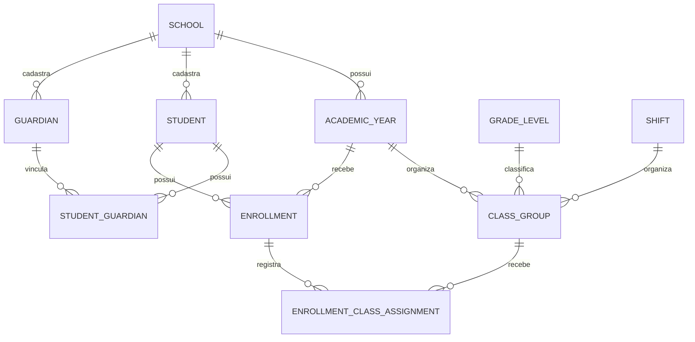

# Modelo mínimo escolar — proposta para validação

Data: 2026-09-29. Status: proposta histórica. Alunos, responsáveis e vínculos estão especificados em [Entrega 2](entrega-2-pessoas-vinculos.md). O recorte inicial de matrícula está em [Entrega 3](entrega-3-matriculas.md); regras de renovação, transferência e outros campos permanecem futuras.

Escopo consolidado em [Arquitetura do sistema escolar — versão 1](arquitetura-sistema-escolar.md):
educação infantil até o 9º ano, com módulos por escola e processos por etapa.
Este documento detalha somente a base inicial. Seus nomes de campos e regras
propostos precisam respeitar essa arquitetura, inclusive grupos da educação infantil.

## Objetivo e sequência

Estabelecer a base para operar matrículas e, depois, renovações:

**Escola e acesso → estrutura escolar → pessoas e vínculos → matrícula → renovação.**

Aluno é uma pessoa cadastrada na escola. Matrícula é seu vínculo com um período
letivo. Renovação é um processo que pode gerar uma nova matrícula, preservando
a anterior. Cadastro de responsável não equivale a conta de acesso.

Esta proposta mantém o monólito modular existente. Financeiro, notas, frequência,
assinatura, armazenamento de documentos e integrações não fazem parte desta entrega.

## Base existente e autoridade

- [ADR-001](../decisoes/ADR-001-isolamento-multi-escola.md): identidade vinculada a uma escola, e-mail globalmente único e isolamento RLS.
- [ADR-002](../decisoes/ADR-002-restricao-alfa-auth.md): fronteira restrita de autenticação.
- [TenantContext](tenant-context.md): contexto autenticado, transação e privilégios mínimos.
- Migrations 001–003: escolas, usuários e auditoria; sem tabelas escolares de negócio.

As decisões aceitas acima permanecem válidas. Em particular, `platform_admin`
não recebe acesso global. Participação de uma conta em várias escolas depende
de decisão explícita; não será contornada alterando o índice de e-mail.

## Entidades propostas

Nomes técnicos são propostos, ainda sem DDL. Todas as novas tabelas pertencem
a uma escola e terão `id UUID`, `school_id`, `created_at` e `updated_at`.
Datas civis usam DATE; eventos usam TIMESTAMPTZ. Campos obrigatórios de cadastro
dependem da validação do processo, conforme pendências abaixo.

| Entidade | Campos específicos mínimos propostos | Responsabilidade |
| --- | --- | --- |
| `academic_years` | code, starts_on, ends_on, status | Período letivo da escola; código único por escola e início anterior ao fim. |
| `grade_levels` | code, name, active | Série/etapa oferecida; sem assumir progressão automática ou nomenclatura nacional única. |
| `shifts` | code, name, active | Turnos configurados pela escola. |
| `class_groups` | academic_year_id, grade_level_id, shift_id, code, capacity, status | Turma de um período, série/etapa e turno; capacidade positiva quando definida. |
| `students` | full_name, birth_date, registration_code | Cadastro duradouro do aluno na escola; código escolar único quando atribuído. Nome não é identificador único. |
| `guardians` | full_name, email, phone, user_id opcional | Pessoa responsável, com ou sem conta; e-mail de contato não concede acesso. |
| `student_guardians` | student_id, guardian_id, relationship, is_legal, is_financial, portal_access, valid_from, valid_until | Vínculo explícito por aluno, atribuições independentes e vigência. Permissão de portal começa negada. |
| `enrollments` | student_id, academic_year_id, grade_level_id, shift_id, enrollment_number, status | Vínculo escolar no período, independente da identidade do aluno. |
| `enrollment_class_assignments` | enrollment_id, class_group_id, starts_on, ends_on | Histórico de alocação em turma; mudança não sobrescreve a alocação anterior. |

Datas, status, nulabilidade e limites de campos serão fechados antes do DDL.
Não exigir CPF nem deduplicar pessoas apenas por nome/e-mail sem regra aprovada.
Não incluir endereço, saúde ou documentos por conveniência: cada dado precisa
de finalidade no fluxo definido.

O diagrama mostra relações principais; todas continuam limitadas à escola.
Um cadastro de responsável pode se vincular a vários alunos, e um aluno a
vários responsáveis. O vínculo opcional com `users` deve ser único por escola
quando preenchido e criado por procedimento autorizado, nunca por coincidência
de e-mail. Não haverá compartilhamento automático de pessoas entre escolas.

## Integridade e segurança exigidas para a implementação

1. `school_id` vem exclusivamente da identidade autenticada. IDs de entidades
   enviados pelo cliente são referências a validar, nunca autoridade de acesso.
2. Cada tabela recebe ENABLE/FORCE RLS, USING e WITH CHECK, mantendo a regra de
   escola autorizada. A verificação de startup deve incluir as novas tabelas.
3. Cada referência interna usa FK composta com `school_id` e chave única
   correspondente `(school_id, id)`. RLS não substitui integridade referencial.
4. Alocação exige turma e matrícula da mesma escola, período, série e turno.
   A implementação deverá provar também essa compatibilidade; duas FKs por ID
   e escola, sozinhas, não garantem todos esses atributos.
5. Não haverá exclusão física em cascata do histórico escolar. Encerramento,
   correção e eventual descarte terão procedimentos definidos separadamente.
6. Mudanças de turma mantêm o histórico. Sobreposição de alocações e matrícula
   simultânea dependem de regra de negócio explícita, antes das constraints.
7. Escrita, validação de autorização atual e auditoria ocorrem na mesma
   transação e conexão do TenantContext. Falha de auditoria reverte a operação.
8. Grants de escrita serão específicos por tabela/operação. Sem credencial
   administrativa no HTTP, grants gerais ou novas funções privilegiadas implícitas.
9. Auditoria registra ator, escola, ação, entidade, momento e alterações
   necessárias, sem copiar indiscriminadamente dados pessoais para JSON.
   Runtime não recebe UPDATE/DELETE dos eventos; a consistência ator–escola da
   tabela existente também precisa ser reforçada antes de novas escritas.
10. Idempotência e concorrência são parte do contrato: repetir uma solicitação
    não duplica o efeito. Mesma chave com payload divergente gera conflito.
    A unicidade de negócio é proteção adicional, não substituto de idempotência.
11. Se houver limite de vagas, reservar a última vaga deve ser transacional:
    duas requisições concorrentes não podem ambas consumir a mesma disponibilidade.
12. Listagens terão paginação e índices tenant-scoped nas referências consultadas.

## Autorização proposta, ainda não aprovada para novos endpoints

| Ator | Proposta | Limite |
| --- | --- | --- |
| Administrador escolar | Gerenciar estrutura, cadastros, vínculos e matrículas | Somente própria escola; ações auditadas. |
| Secretaria | Executar operações escolares aprovadas | Papel específico ainda pendente; não equiparar automaticamente a administrador. |
| Responsável com portal habilitado | Consultar campos aprovados dos alunos vinculados e enviar solicitações permitidas | Vínculo vigente e autorização por aluno; ser responsável financeiro não implica acesso pedagógico. |
| Professor/outros perfis | Sem novos acessos nesta fase | Exige escopo posterior. |
| Administrador de plataforma | Preservar limite atual à própria escola | Nenhum bypass global. |

A RLS atual separa escolas. A autorização por aluno precisa ser aplicada em
cada leitura/escrita do portal, inclusive listagens e contagens. Conhecer um
UUID, ter o mesmo sobrenome ou compartilhar e-mail não autoriza acesso.

## Ciclo de matrícula proposto

Proposta inicial: `draft → active → completed`, com saídas para `cancelled`
ou `transferred_out` conforme regras a aprovar. Esses nomes não estão aprovados
como enum, nem definem sozinhos quem pode executar cada transição.

A ativação depende dos requisitos acordados com a escola. A necessidade de
turma definida nesse momento está pendente. Cancelamento, transferência,
reabertura e correções devem registrar motivo e ator. Não permitir atualização
arbitrária de status nem presumir aprovação pedagógica pela passagem do tempo.

A renovação será desenhada depois desta base: referenciará a matrícula de
origem e o período pretendido, com solicitação separada da matrícula resultante.
Não promove automaticamente o aluno nem altera seu histórico anterior.

## Decisões pendentes antes de migrations

| ID | Decisão necessária | Consequência |
| --- | --- | --- |
| P01 | Escopo RESOLVIDO: educação infantil até 9º ano; cada escola oferece uma ou várias etapas. PENDENTE: turmas multisseriadas. | Modelar grupos/séries por etapa; validar cardinalidade antes do DDL. |
| P02 | RESOLVIDA: uma matrícula por aluno e período letivo no recorte inicial. Atividades simultâneas não fazem parte dele. | Constraint única em escola/aluno/período; revisão explícita se a regra mudar. |
| P03 | RESOLVIDA: turma obrigatória; controle de capacidade fora do recorte inicial. | FKs compostas validam turma/período/grupo; sem reserva nem promessa de vagas. |
| P04 | Quem pode cadastrar vínculos, ativar, cancelar e transferir matrículas? | Define permissões, transições e eventual papel de secretaria. |
| P05 | Quais dados são obrigatórios e como chegam os alunos atuais: cadastro manual ou importação? | Define validação e tratamento de duplicidade/origem. |
| P06 | O piloto inclui responsável no portal? Qual responsável vê e faz o quê? | Bloqueia habilitação do portal até definir vínculo e campos visíveis. |
| P07 | A mesma conta precisa acessar mais de uma escola nesta etapa? | Se sim, exige decisão própria de identidade e revisão explícita do ADR-001. |
| P08 | Quais requisitos confirmam a matrícula e quem aprova? | Define diferença entre solicitação, matrícula ativa e renovação concluída. |

O alcance de etapas de P01 foi definido na conversa; as demais respostas não
foram presumidas. P06–P08 podem permanecer
fora de uma primeira entrega exclusivamente interna, desde que esse recorte
seja explicitamente aprovado. As demais precisam ser resolvidas para fechar
o modelo correspondente.

## Sequência de entregas e critérios de aceite

1. Validar P01–P08 e registrar o recorte aprovado neste documento.
2. Fechar dicionário de dados, estados, matriz de permissões e contratos HTTP.
3. Implementar estrutura escolar com migrations futuras, RLS e testes.
4. Implementar alunos, responsáveis e vínculos com auditoria transacional.
5. Implementar matrícula e histórico de turma com integridade e concorrência.
6. Integrar telas aos endpoints aprovados; depois desenhar renovação e portal.

Provas mínimas para a futura entrega:

- Escola A não lê, altera nem referencia entidades de B; contexto ausente falha fechado.
- Responsável não consulta outro aluno da própria escola; listagens também respeitam vínculos.
- Revogação de vínculo bloqueia novas operações; perfil sem permissão não grava.
- Matrícula/alocação incompatível com ano, série, turno ou escola é recusada.
- Reenvio e concorrência não duplicam matrícula nem excedem vagas conforme a regra aprovada.
- Transferência de turma mantém o histórico; renovação não altera a matrícula anterior.
- Falha intermediária reverte dados e auditoria; cada operação confirmada tem evento correspondente.
- Migrations futuras preservam dados e controles existentes; suíte de segurança sem regressões.

## Situação desta entrega

Somente desenho documental. Nenhuma migration, grant, endpoint, dado ou tela
foi alterado. Critérios acima são requisitos futuros, não testes já executados.
Implementação permanece pendente das decisões de negócio e validação do modelo.
